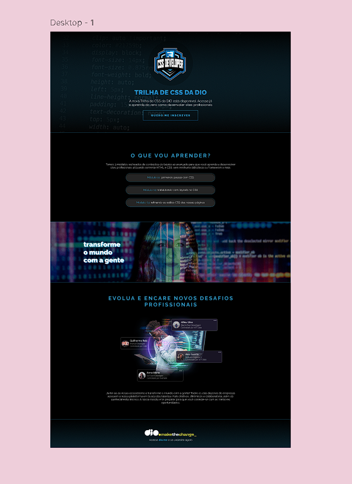

<h1>Formação CSS Web Developer Landing Page</h1>

<h2>The objective for this project is to building a landing page about the program "Formacao CSS Web Developer" at DIO following the design model below, using only HTML and CSS.</h2>  

  

<h2>The result:</h2>

